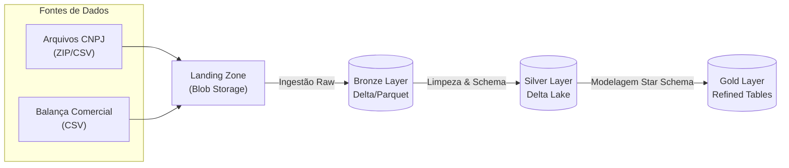

# 📊 Projeto Integrado - Pipeline de Dados (CNPJ & Balança Comercial)


Este projeto implementa um pipeline de engenharia de dados robusto e escalável para processamento de dados públicos do **CNPJ** e da **Balança Comercial Brasileira**. O sistema utiliza **PySpark** para processamento distribuído e **Azure Blob Storage** como Data Lake, seguindo a arquitetura **Medallion (Bronze, Silver, Gold)**.

---

## 📑 Índice

*   [🏗️ Arquitetura e Fluxo de Dados](#-arquitetura-e-fluxo-de-dados)
*   [🚀 Funcionalidades e Diferenciais](#-funcionalidades-e-diferenciais)
*   [⚙️ Configurações de Otimização (Delta Lake)](#-configurações-de-otimização-delta-lake)
*   [📂 Estrutura do Projeto](#-estrutura-do-projeto)
*   [🛠️ Como Executar](#-como-executar)
*   [🧠 Decisões de Design](#-decisões-de-design)
*   [🔧 Troubleshooting](#-troubleshooting)

---

## 📚 Documentação Completa (Manual)

Para detalhes aprofundados sobre cada aspecto do projeto, consulte o **Manual do Usuário** localizado na pasta `docs/manual`:

| Seção | Descrição |
| :--- | :--- |
| [00. Escopo e Cronograma](docs/manual/00_escopo_e_cronograma.md) | Visão geral dos objetivos, entregáveis e cronograma do projeto. |
| [01. Visão Geral](docs/manual/01_visao_geral.md) | Introdução ao contexto de negócio e solução técnica. |
| [02. Configuração do Ambiente](docs/manual/02_configuracao_ambiente.md) | Guia passo-a-passo para preparar o ambiente (Local/Azure/Databricks). |
| [03. Execução do Pipeline](docs/manual/03_execucao_pipeline.md) | Instruções detalhadas para rodar os scripts de ingestão e transformação. |
| [04. Arquitetura Detalhada](docs/manual/04_arquitetura_detalhada.md) | Diagramas e explicações técnicas sobre as camadas Bronze, Silver e Gold. |
| [05. Troubleshooting](docs/manual/05_guia_troubleshooting.md) | Soluções para erros comuns e problemas conhecidos. |
| [06. Dicionário de Dados](docs/manual/06_dicionario_dados.md) | Detalhamento das tabelas e colunas da camada Gold (Refined). |

---

## 🏗️ Arquitetura e Fluxo de Dados

O projeto segue o padrão Medallion para garantir qualidade e governança dos dados.



1.  **Landing Zone**: Dados brutos hospedados no Azure Blob Storage (containers `landing...`).
2.  **Bronze Layer**: Dados ingeridos "as-is", convertidos para Delta/Parquet para performance, mantendo histórico.
3.  **Silver Layer**: Dados limpos, tipados (Schema Enforcement), deduplicados e enriquecidos com regras de negócio.
4.  **Gold Layer**: Dados modelados em **Star Schema** (Fatos e Dimensões) otimizados para Analytics e BI.

---

## 🚀 Funcionalidades e Diferenciais

*   **Ingestão Híbrida Inteligente**: Os scripts detectam automaticamente se estão rodando no **Databricks** ou **Localmente**, ajustando caminhos e métodos de autenticação.
*   **Arquitetura Medallion Completa**: Pipeline implementado de ponta a ponta (Raw -> Trusted -> Refined).
*   **Observabilidade**: Logs detalhados são enviados para o console (com barras de progresso `tqdm`) e persistidos.
*   **Suporte a Windows**: O projeto baixa e configura automaticamente o `winutils.exe` (Hadoop binaries) para permitir a execução do Spark no Windows sem dores de cabeça.
*   **Atomicidade**: Uso de operações atômicas do Delta Lake (`overwrite` mode) e comandos `OPTIMIZE/VACUUM` para performance.
*   **Otimização Automática**: Configuração explícita de `OPTIMIZE` (Target Size: 10MB) e `VACUUM` (Retenção: 60 dias) para manutenção saudável do Data Lake.

---

## ⚙️ Configurações de Otimização (Delta Lake)

Para garantir alta performance de leitura e controle de custos de armazenamento, o pipeline aplica as seguintes políticas nas camadas **Silver** e **Gold**:

1.  **OPTIMIZE (Z-Order & Compaction)**:
    *   Arquivos pequenos são compactados para um tamanho alvo de **10 MB** (`10485760 bytes`).
    *   Isso evita o problema de "small files" que degrada a performance do Spark.
    *   Configuração: `DELTA_OPTIMIZE_FILE_SIZE` em `src/utils/config.py`.

2.  **VACUUM (Limpeza de Histórico)**:
    *   Versões antigas dos dados (ex: arquivos sobrescritos) são removidas fisicamente após **60 dias**.
    *   Isso permite Time Travel (voltar no tempo) por 2 meses, equilibrando segurança e custo.
    *   Configuração: `DELTA_VACUUM_RETENTION_DAYS` em `src/utils/config.py`.

---

## 📂 Estrutura do Projeto

```text
/
├── hadoop/                     # Binários do Hadoop (winutils) gerenciados automaticamente
├── src/
│   ├── scripts/                # Scripts do Pipeline (Execução Sequencial)
│   │   ├── 01_listagem_*.py    # 🔍 Diagnóstico: Lista arquivos na origem
│   │   ├── 02_setup_*.py       # 🛠️ Setup: Cria e valida containers de destino (Raw/Trusted/Refined)
│   │   ├── 03_ingestao_*.py    # 📥 Bronze: Ingestão Balança Comercial
│   │   ├── 04_ingestao_*.py    # 📥 Bronze: Ingestão CNPJ (extração de ZIPs)
│   │   ├── 05_transf_*.py      # 🔄 Silver: Transformação Balança (Limpeza, Tipagem)
│   │   ├── 06_transf_*.py      # 🔄 Silver: Transformação CNPJ (Schema Mapping)
│   │   └── 07_transf_*.py      # 🏆 Gold: Modelagem Dimensional (Star Schema)
│   ├── utils/                  # Bibliotecas compartilhadas
│   │   ├── config.py           # Gerenciamento de configuração e variáveis de ambiente
│   │   ├── logging_utils.py    # Handler de logs customizado
│   │   └── transformations.py  # Funções reutilizáveis Spark
├── requirements.txt            # Dependências do projeto
└── README.md                   # Este arquivo
```

---

## 🛠️ Como Executar

### 1. Pré-requisitos
*   Python 3.8 ou superior.
*   Java 8 ou 11 (JRE/JDK) instalado e configurado no PATH.
*   Acesso aos containers do Azure Blob Storage (SAS Tokens).

### 2. Configuração (.env)
Crie um arquivo `.env` na raiz baseado no `.env.example` e preencha suas credenciais:

```ini
BALANCA_ACCOUNT_URL=https://seu-storage.blob.core.windows.net
AZURE_STORAGE_SAS_TOKEN_BALANCA="?sv=..."
# ... (ver .env.example para lista completa)
```

### 3. Execução do Pipeline
Os scripts devem ser executados sequencialmente para garantir a dependência dos dados:

```bash
# 1. Diagnóstico e Setup
python src/scripts/01_listagem_arquivos_azure.py
python src/scripts/02_setup_validacao_targets.py

# 2. Camada Bronze (Ingestão)
python src/scripts/03_ingestao_bronze_balanca.py
python src/scripts/04_ingestao_bronze_cnpj.py

# 3. Camada Silver (Transformação)
python src/scripts/05_transformacao_silver_balanca.py
python src/scripts/06_transformacao_silver_cnpj.py

# 4. Camada Gold (Refinamento)
python src/scripts/07_transformacao_gold.py
```

---

## 🧠 Decisões de Design

### Por que Delta Lake?
Utilizamos Delta Lake nas camadas Silver e Gold para garantir **ACID Transactions**. Isso nos permite sobrescrever dados de forma segura (`overwriteSchema`) sem corromper leituras concorrentes e sem precisar deletar diretórios manualmente.

### Tratamento de Arquivos ZIP (CNPJ)
Os dados do CNPJ vêm em arquivos ZIP massivos contendo CSVs. Nossa estratégia de ingestão (Script 04):
1.  Faz o download em streaming (chunks) para evitar estouro de memória.
2.  Extrai localmente em área temporária.
3.  Lê com Spark e converte imediatamente para Parquet/Delta, descartando o CSV bruto.

### Fallback de Caminhos (`__file__`)
Para suportar execução local (VS Code) e remota (Databricks Notebooks), usamos um padrão robusto de resolução de caminhos:
```python
try:
    base_dir = os.path.dirname(os.path.abspath(__file__)) # Funciona local
except NameError:
    base_dir = os.getcwd() # Funciona no Databricks
```

---

## 🔧 Troubleshooting

| Erro | Causa Provável | Solução |
|------|----------------|---------|
| `DirectoryIsNotEmpty` | Conflito na sobrescrita de diretórios no Blob Storage. | O código já foi atualizado para usar `.mode("overwrite")` do Delta. Não apague pastas manualmente durante a execução. |
| `Winutils not found` | Falta de binários do Hadoop no Windows. | O script baixa o `winutils.exe` automaticamente. Se falhar, verifique sua conexão ou permissões na pasta `hadoop/`. |
| `403 Forbidden` | Token SAS expirado ou incorreto. | Verifique o `.env`. O token deve começar com `?` e não deve conter quebras de linha. |

---

**Desenvolvido por Grupo 4**
