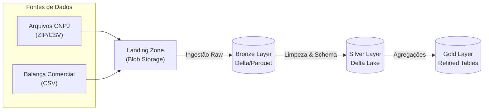

# 📊 Projeto Integrado - Pipeline de Dados (CNPJ & Balança Comercial)


Este projeto implementa um pipeline de engenharia de dados robusto e escalável para processamento de dados públicos do **CNPJ** e da **Balança Comercial Brasileira**. O sistema utiliza **PySpark** para processamento distribuído e **Azure Blob Storage** como Data Lake, seguindo a arquitetura **Medallion (Bronze, Silver, Gold)**.

---

## 🏗️ Arquitetura e Fluxo de Dados

O projeto segue o padrão Medallion para garantir qualidade e governança dos dados.



1.  **Landing Zone**: Dados brutos hospedados no Azure Blob Storage (containers `landing...`).
2.  **Bronze Layer**: Dados ingeridos "as-is", convertidos para Delta/Parquet para performance, mantendo histórico.
3.  **Silver Layer**: Dados limpos, tipados (Schema Enforcement), deduplicados e enriquecidos com regras de negócio.
4.  **Gold Layer**: (Roadmap) Dados agregados prontos para consumo por ferramentas de BI (Power BI, Tableau).

---

## 🚀 Funcionalidades e Diferenciais

*   **Ingestão Híbrida Inteligente**: Os scripts detectam automaticamente se estão rodando no **Databricks** ou **Localmente**, ajustando caminhos e métodos de autenticação.
*   **Orquestração Centralizada**: Um único ponto de entrada (`00_setup.py`) gerencia dependências e a execução sequencial do pipeline.
*   **Observabilidade**: Logs detalhados são enviados para o console (com barras de progresso `tqdm`) e persistidos automaticamente no container `$logs` do Azure.
*   **Suporte a Windows**: O projeto baixa e configura automaticamente o `winutils.exe` (Hadoop binaries) para permitir a execução do Spark no Windows sem dores de cabeça.
*   **Atomicidade**: Uso de operações atômicas do Delta Lake (`overwrite` mode) para evitar estados inconsistentes e erros de `DirectoryIsNotEmpty`.

---

## 📚 Documentação Completa

A documentação detalhada do projeto foi movida para a pasta `docs/manual/`. Consulte os guias abaixo para mais informações:

1.  [Visão Geral](docs/manual/01_visao_geral.md)
2.  [Configuração do Ambiente](docs/manual/02_configuracao_ambiente.md)
3.  [Execução do Pipeline](docs/manual/03_execucao_pipeline.md)
4.  [Arquitetura Detalhada](docs/manual/04_arquitetura_detalhada.md)
5.  [Guia de Troubleshooting](docs/manual/05_guia_troubleshooting.md)

## 📂 Estrutura do Projeto

```text
/
├── docs/                       # Documentação
│   ├── manual/                 # 📘 Manuais e guias do projeto
│   └── schemas/                # 📋 Schemas JSON (CNPJ, Balança)
├── hadoop/                     # Binários do Hadoop (winutils) gerenciados automaticamente
├── src/
│   ├── scripts/                # Scripts do Pipeline
│   │   ├── 00_setup.py         # 🎮 Orchestrator: Gerencia todo o fluxo
│   │   ├── 01_listagem_*.py    # 🔍 Diagnóstico: Lista arquivos na origem para conferência
│   │   ├── 02_setup_*.py       # 🛠️ Setup: Cria e valida containers de destino (Raw/Trusted)
│   │   ├── 03_ingestao_*.py    # 📥 Bronze: Ingestão Balança Comercial
│   │   ├── 04_ingestao_*.py    # 📥 Bronze: Ingestão CNPJ (extração de ZIPs)
│   │   ├── 05_transf_*.py      # 🔄 Silver: Transformação Balança (Limpeza, Tipagem)
│   │   └── 06_transf_*.py      # 🔄 Silver: Transformação CNPJ (Schema Mapping)
│   ├── utils/                  # Bibliotecas compartilhadas
│   │   ├── config.py           # Gerenciamento de configuração e variáveis de ambiente
│   │   ├── logging_utils.py    # Handler de logs customizado
│   │   └── transformations.py  # Funções reutilizáveis Spark
├── requirements.txt            # Dependências do projeto
└── README.md                   # Este arquivo
```

---

## 🛠️ Como Executar

### 1. Pré-requisitos
*   Python 3.8 ou superior.
*   Java 8 ou 11 (JRE/JDK) instalado e configurado no PATH.
*   Acesso aos containers do Azure Blob Storage (SAS Tokens).

### 2. Configuração (.env)
Crie um arquivo `.env` na raiz baseado no `.env.example` e preencha suas credenciais:

```ini
BALANCA_ACCOUNT_URL=https://seu-storage.blob.core.windows.net
AZURE_STORAGE_SAS_TOKEN_BALANCA="?sv=..."
# ... (ver .env.example para lista completa)
```

### 3. Execução
O modo mais fácil é usar o orquestrador:

```bash
# Executa tudo (Instalação + Bronze + Silver)
python src/scripts/00_setup.py

# Se já instalou as libs, pule a etapa de deps:
python src/scripts/00_setup.py --skip-deps

# Para rodar apenas a camada Silver (ex: reprocessamento):
python src/scripts/00_setup.py --skip-deps --skip-bronze
```

---

## 🧠 Decisões de Design

### Por que Delta Lake?
Utilizamos Delta Lake na camada Silver para garantir **ACID Transactions**. Isso nos permite sobrescrever dados de forma segura (`overwriteSchema`) sem corromper leituras concorrentes e sem precisar deletar diretórios manualmente, prevenindo erros de `DirectoryIsNotEmpty`.

### Tratamento de Arquivos ZIP (CNPJ)
Os dados do CNPJ vêm em arquivos ZIP massivos contendo CSVs. Nossa estratégia de ingestão (Script 04):
1.  Faz o download em streaming (chunks) para evitar estouro de memória.
2.  Extrai localmente em área temporária.
3.  Lê com Spark e converte imediatamente para Parquet/Delta, descartando o CSV bruto.

### Fallback de Caminhos (`__file__`)
Para suportar execução local (VS Code) e remota (Databricks Notebooks), usamos um padrão robusto de resolução de caminhos:
```python
try:
    base_dir = os.path.dirname(os.path.abspath(__file__)) # Funciona local
except NameError:
    base_dir = os.getcwd() # Funciona no Databricks
```

---

## 🔧 Troubleshooting

| Erro | Causa Provável | Solução |
|------|----------------|---------|
| `DirectoryIsNotEmpty` | Conflito na sobrescrita de diretórios no Blob Storage. | O código já foi atualizado para usar `.mode("overwrite")` do Delta. Não apague pastas manualmente durante a execução. |
| `Winutils not found` | Falta de binários do Hadoop no Windows. | O script baixa o `winutils.exe` automaticamente. Se falhar, verifique sua conexão ou permissões na pasta `hadoop/`. |
| `403 Forbidden` | Token SAS expirado ou incorreto. | Verifique o `.env`. O token deve começar com `?` e não deve conter quebras de linha. |

---

**Desenvolvido por Grupo 4**
