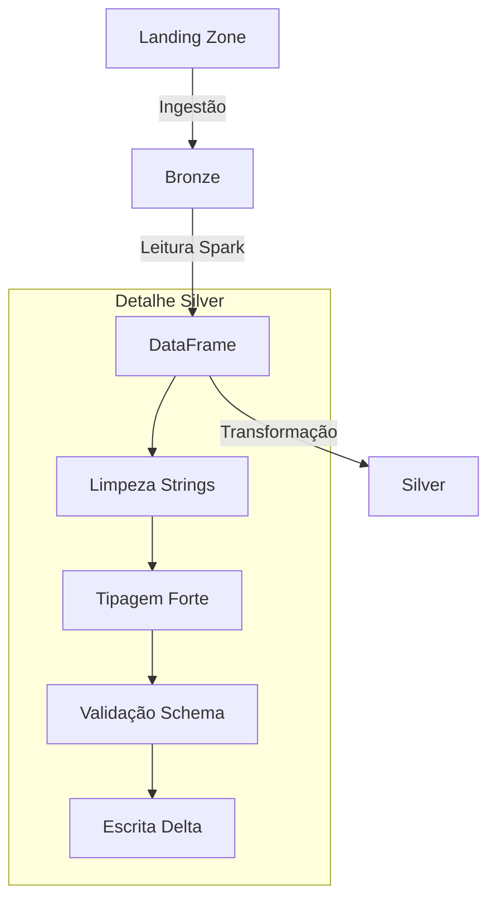

[Escopo](./00_escopo_e_cronograma.md) | [Visão Geral](./01_visao_geral.md) | [Configuração](./02_configuracao_ambiente.md) | [Execução](./03_execucao_pipeline.md) | **Arquitetura** | [Troubleshooting](./05_guia_troubleshooting.md)

---

# 4. Arquitetura Detalhada

## 📐 Padrão Medallion

### 🥉 Bronze Layer (Raw)
*   **Objetivo**: Armazenar dados brutos com histórico, sem perda de informação.
*   **Formato**: Delta Lake (preferencial) ou Parquet.
*   **Estratégia CNPJ**:
    *   Os arquivos originais são ZIPs contendo CSVs.
    *   Extraímos o CSV e convertemos para Parquet/Delta.
    *   Mantemos todas as colunas como `string` para evitar erros de leitura.
*   **Estratégia Balança**:
    *   Leitura direta dos CSVs da origem.
    *   Conversão para Delta.

### 🥈 Silver Layer (Trusted)
*   **Objetivo**: Dados limpos, validados e prontos para análise (Data Quality).
*   **Formato**: Delta Lake.
*   **Transformações Aplicadas**:
    *   **Renomeação**: Colunas convertidas para *snake_case* e removidos acentos (`normalize_column_name`).
    *   **Tipagem**: Conversão de strings para Inteiros, Decimais, Datas, etc.
    *   **Limpeza**: Tratamento de nulos e espaços em branco (`trim`).
    *   **Schema Enforcement**: Validação rígida contra os schemas definidos em `docs/schemas/`.
*   **Escrita Atômica**:
    *   Usamos `.mode("overwrite")` do Delta.
    *   Isso substitui os dados atomicamente, evitando o erro clássico de `DirectoryIsNotEmpty` do Hadoop.

## 🔄 Fluxo de Dados

## 🔐 Segurança
*   **Credenciais**: Nunca hardcoded. Sempre via variáveis de ambiente (`.env` ou Secrets).
*   **Rede**: Acesso via HTTPS (TLS 1.2+).
*   **Logs**: Não logamos dados sensíveis, apenas metadados de execução.
